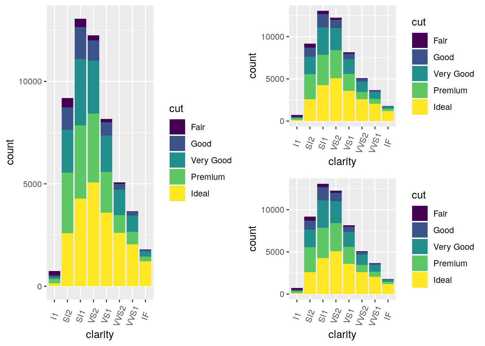

```{r setup, include=FALSE}
knitr::opts_chunk$set(echo = TRUE)
```

#PlottingLab2

```{r ggplot}
library(ggplot2)
plot.diamonds <- ggplot(diamonds, aes(clarity, fill = cut)) + geom_bar() +
  theme(axis.text.x = element_text(angle=70, vjust=0.5))
plot.diamonds

ggsave("diamonds.tif",device="tiff", dpi = 600)

```


##Multi-panel plots


_Use the `ggpubr` library to generate a plot like the following._




```{r multi_panel}
library(ggpubr)

ggarrange(plot.diamonds,                                      
          ggarrange(plot.diamonds, plot.diamonds, nrow = 2), 
          ncol = 2                                        
          ) 

```


_What is the key function?_

`ggpubr::ggarrange`

_How do you flip the column/row layout?_

Swap the `nrow=` and `ncol=` arguments; inside the nested `ggarrange` function, the row/col argument determines the location of the two associated sub-ggplots also in the parantheses, whereas outside of the nested `ggarrange` function it determines the layout of the first figure and the nested ggarrange subplots. i.e. determine arrangement of main plot and subplots, then arrangement of the subplots themselves with a nested `ggarrange`:

```{r multi_panel_flip}


library(ggpubr)

ggarrange(plot.diamonds,                                      
          ggarrange(plot.diamonds, plot.diamonds, ncol = 2), 
          nrow = 2                                        
          ) 

```

_Can you do this with the egg package? (I couldn't!)_

```{r egg_flip}

library(egg)

```


_Is there something weird about these two packages? Yes, which confused the hell out of me for a little while :)._

These two packages have a function with the same name (ggarrange), and when this is the case R will call the function that appears first in the `search` path. This can be circumventing by specifying the package with a double collon when calling the function, i.e. `ggpubr::ggarrange`.


##littler


_1. Install littler_
*2. Use readr::write_delim to write the diamonds dataset to a text file*
_3. Write a script that takes your file as an "input file name" argument and saves a pdf of a plot to an "output file name" argument._

From a Unix OS:

Install littler with:
```
$ apt-get install r-cran-littler
```

Then write a script and save as "littlerplot.r":
```
#!/usr/bin/env r

library(ggplot2)
library(readr)
library(optparse)

option_list <- list( 
  make_option("--file", default="diamonds.txt", 
              help="Input file name"),
  make_option("--out", default="diamondsagain.pdf",
              help="Output file name")
)

opt <- parse_args(OptionParser(option_list=option_list))

x <- read_delim(opt$file, delim="\t")


plot.diamonds <- ggplot(x, aes(clarity, fill = cut)) + geom_bar() +
  theme(axis.text.x = element_text(angle=70, vjust=0.5))

ggsave(opt$out,device="pdf", dpi = 600)

```

Create the text file:
```
$ r -e 'readr::write_delim(ggplot2::diamonds, path="diamonds.txt", delim="\t")'
```

And run the script with the appropriate arguments:
```
$ r littlerplot.r diamonds.txt newdiamonds.pdf
```

_How can you error check your arguments? What if the input file doesn't exist?_

Add the following to your littlerplot script:
```
if (is.null(opt$file)){
  print_help(opt_parser)
  stop("Please supply input file.")
}
```

_How would you change it from positional arguments to argument flags, e.g. from:_

```r foo.r infile outfile```

to

```r foo.r --infile=infile --outfile=outfile```

_Hint: look up the optparse library._

You could add options for infile and outfile after loading the optparse library, e.g.:

```
make_option("--infile", default="diamonds.txt", 
              help="infile"),
make_option("--outfile", default="diamonds.txt", 
              help="outfile")
```

_How would you make your littler script executable, so that you can execute it as:_

```
./foo.r
```

You would just change permissions:
```
chmod +x littlerplot.r
```

##reticulate


_Install reticulate if you haven't already_
_Make sure it points to your correct Python, e.g. the output of the shell command which python3._

```{r reticulate}
library(reticulate)
use_python("/usr/bin/python3")
```

_Test that this works:_
```{r reticulate_test}
pd <- import("pandas", convert=F) #Import the specified Python module for calling from R; false to not auto convert python objects to R equivalent

x = data.frame(x=rnorm(100),y=rnorm(100)) #create a two col, 100 row df with normal distribution

y = pd$DataFrame(r_to_py(x)) #manually convert R dataframe "x" to python equivalent dataframe object defined in pandas module
z = py_to_r(y$describe()) #use python dataframe y's method ".describe()" to summarize descriptive statistics for the dataframe, and then convert python object to R
print(z)
```

_What happened there? Cool, right?_

We created a dataframe in R with two columns of 100 rows with normal distribution that we then converted to a python dataframe. We next used that object's built-in python method .describe() to summarize the descriptive statistics of the data, and finally converted this back to an R dataframe and printed it - all within an R environment.


*Does it work for you if you get rid of convert=F and the r_to_py and py_to_r stuff? It doesn't for me, and I am not sure why.*

No, even if I manually set convert=TRUE it fails to convert the dataframe stored in y into a python object, and so `Error: attempt to apply non-function` occurs when trying to call .describe() on it in the next line.

##What about this?

_Write some data into a text file:_

```
experiment result
A 0.151252
A 0.1351351235215
B 1.35125125
B 2.1251251253
C 1.1
```

```{r txt_file}

a <- data.frame(c("A","A","B","B","C"), c(0.151252, 0.1351351235215, 1.35125125, 2.1251251253, 1.1))

names(a) <- c("experiment","result")

write.table(a, file="data2.txt", sep=" ", row.names=FALSE)

```

```{python}
import pandas as pd

x = pd.read_csv("data2.txt",sep=" ")
```

_ Execute the following Python code in an Rmd file:_
```{r}
py$x
```


_How can you execute an external python script and return the results to R? Can you recreate the above steps using a separate Python script and get a data.frame back into R?_

```{r py_back_into_r}

py_run_file("back_into_r.py")

x <- read.csv("data3.txt", sep = "\t")

x
```

##Python and GridSpec

_Can you recreate a plot similar to what you did at the beginning using gridspec?_
